title: Publications
date: 2020-11-27

menu-position: 1
---

Wei Chien Benny Chin  
(updated: 2020-11-27)

Most papers are avaiable online as open access paper. 
Please contact me (<a href="mailto:wcchin.88@gmail.com">wcchin.88@gmail.com</a>) if you need fulltext of the non-open-access articles or have difficulties on getting the official latest version of paper. 

---

# Publications
### SSCI Journal Article  

-  Manivannan, A., **Chin, W. C. B.**, Barrat, A., and Bouffanais, R. (2020) On the Challenges and Potential of Using Barometric Sensors to Track Human Activity. *Sensors* 20(23): 6786. 
  <i class="ai ai-doi"></i>: [10.3390/s20236786](https://doi.org/10.3390/s20236786)<i class="ai ai-open-access"></i>(registering)  
  URL <i class="ai ai-open-access"></i>: [https://www.mdpi.com/1424-8220/20/23/6786](https://www.mdpi.com/1424-8220/20/23/6786)<i class="ai ai-open-access"></i>  
  

 
  
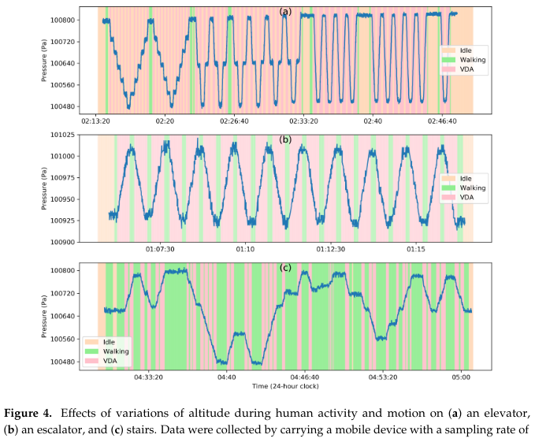
  
  ---
 
-  **Chin, W. C. B.**, & Bouffanais, R. (2020) Spatial super-spreaders and super-susceptibles in human movement networks. *Scientific Reports* 10: 18642. 
  <i class="ai ai-doi"></i>: [10.1038/s41598-020-75697-z](https://doi.org/10.1038/s41598-020-75697-z)<i class="ai ai-open-access"></i>  
  (Journal rank: 10/64 in Multidisciplinary Sciences)
  <!--<i class="ai ai-arxiv"></i>: [2005.05063](https://arxiv.org/abs/2005.05063).<i class="ai ai-open-access"></i>-->  
  

  
  

 
  
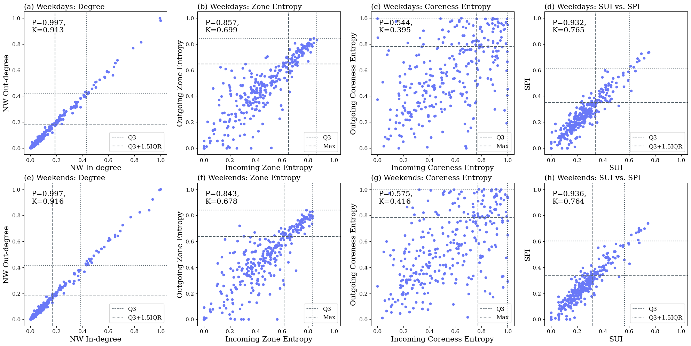
  
  ---
  
-  Huang C. Y., **Chin, W. C. B.** (2020) Distinguishing arc types to understand complex network strength structures and hierarchical connectivity patterns. *IEEE Access* 8: 71021-71040. 
  <i class="ai ai-doi"></i>: [10.1109/ACCESS.2020.2986017](https://doi.org/10.1109/ACCESS.2020.2986017)<i class="ai ai-open-access"></i>
  

  
  
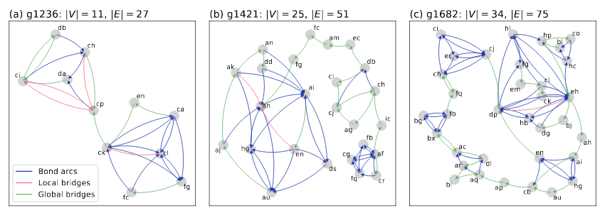
  
  ---
  
- Huang C. Y., **Chin, W. C. B.**, Fu, Y. H., & Tsai, Y. S. (2019) Beyond Bond Links in Complex Networks: Local Bridges, Global Bridges and Silk Links. *Physica A: Statistical Mechanics and its Applications* 536: 121027.  
  <i class="ai ai-doi"></i>: [10.1016/j.physa.2019.04.263](https://doi.org/10.1016/j.physa.2019.04.263)<i class="ai ai-open-access"></i>
  

  
  
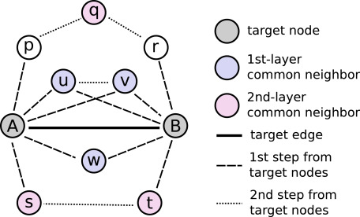
  
  ---
  
- Huang C. Y., **Chin, W. C. B.**, Wen, T. H., Fu, Y. H., & Tsai, Y. S. (2019) EpiRank: Modeling Bidirectional Disease Spread in Asymmetric Commuting Networks. *Scientific Reports* 9: 5415.  
  <i class="ai ai-doi"></i>: [10.1038/s41598-019-41719-8](https://doi.org/10.1038/s41598-019-41719-8)<i class="ai ai-open-access"></i>  
  (Journal rank: 10/64 in Multidisciplinary Sciences)
  

  
  
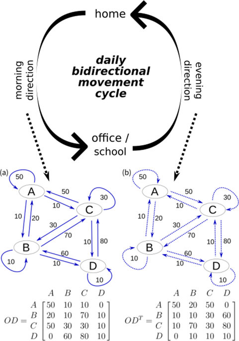
  
  ---
  
- **Chin, W. C. B.**, Wen, T. H., Sabel, C. E., & Wang, I. H. (2017) A geo-computational algorithm for exploring the structure of diffusion progression in time and space. *Scientific Reports* 7: 12565. 
  <i class="ai ai-doi"></i>: [10.1038/s41598-017-12852-z](https://doi.org/10.1038/s41598-017-12852-z)<i class="ai ai-open-access"></i>  
  (Journal rank: 10/64 in Multidisciplinary Sciences)
  

  
  
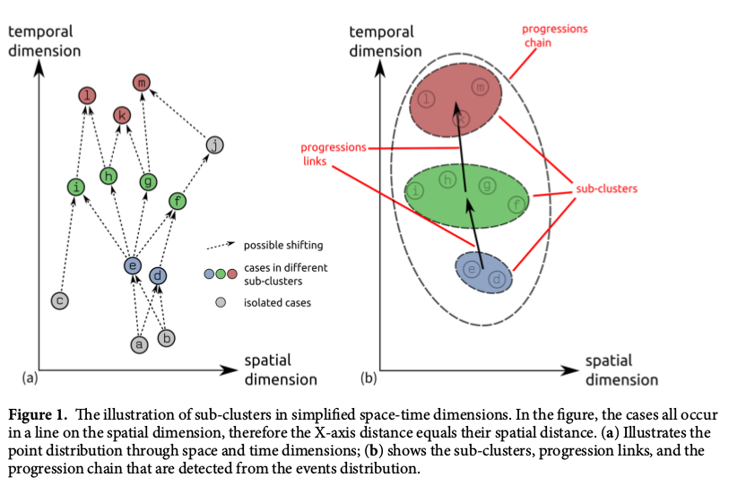
  
  ---
  
- Wen, T. H., **Chin, W. C. B.**, & Lai, P. C. (2017) Understanding the topological characteristics and flow complexity of urban traffic congestion. *Physica A: Statistical Mechanics and its Applications* 473: 166-177. 
  <i class="ai ai-doi"></i>: [10.1016/j.physa.2017.01.035](https://doi.org/10.1016/j.physa.2017.01.035)   
  (Journal rank: 23/79 in Physics, Multidisciplinary Science)
  

  
  
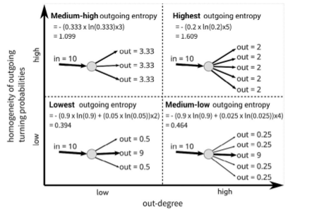
  
  ---
  
- Wen, T. H., Tsai, C. T., & **Chin, W. C. B.** (2016). Evaluating the role of disease importation in the spatiotemporal transmission of indigenous dengue outbreak. *Applied Geography* 76: 137-146. 
  <i class="ai ai-doi"></i>: [10.1016/j.apgeog.2016.09.020](https://doi.org/10.1016/j.apgeog.2016.09.020)   
  (Journal rank: 10/77 in Geography)
  

  
  
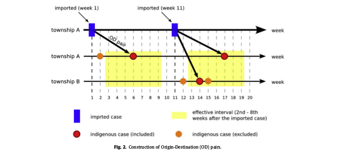
  
  ---
  
- **Chin, W. C. B.**, & Wen, T. H. (2015). Geographically Modified PageRank Algorithms: Identifying the Spatial Concentration of Human Movement in a Geospatial Network. *PLoS ONE* 10(10): e0139509. 
  <i class="ai ai-doi"></i>: [10.1371/journal.pone.0139509](https://doi.org/10.1371/journal.pone.0139509)<i class="ai ai-open-access"></i>
  (Journal rank: 15/64 in Multidisciplinary Sciences)
  

  
  
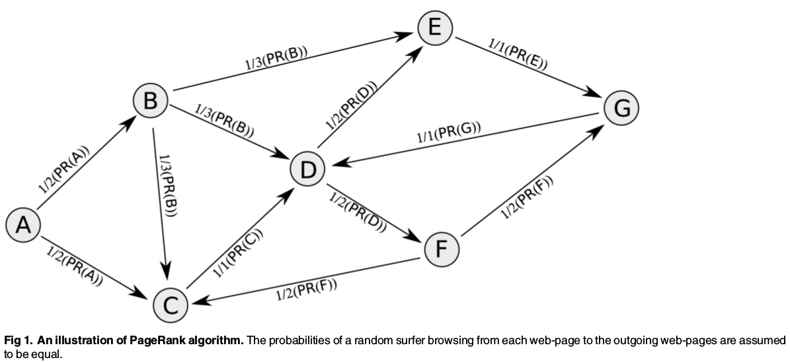
  
  ---
  
- Wen, T. H., & **Chin, W. C. B.** (2015). Incorporation of Spatial Interactions in Location Networks to Identify Critical Geo-Referenced Routes for Assessing Disease Control Measures on a Large-Scale Campus. *International Journal of Environmental Research and Public Health* 12(4): 4170-4184.  
  <i class="ai ai-doi"></i>: [10.3390/ijerph120404170](https://doi.org/10.3390/ijerph120404170)
  

  
  
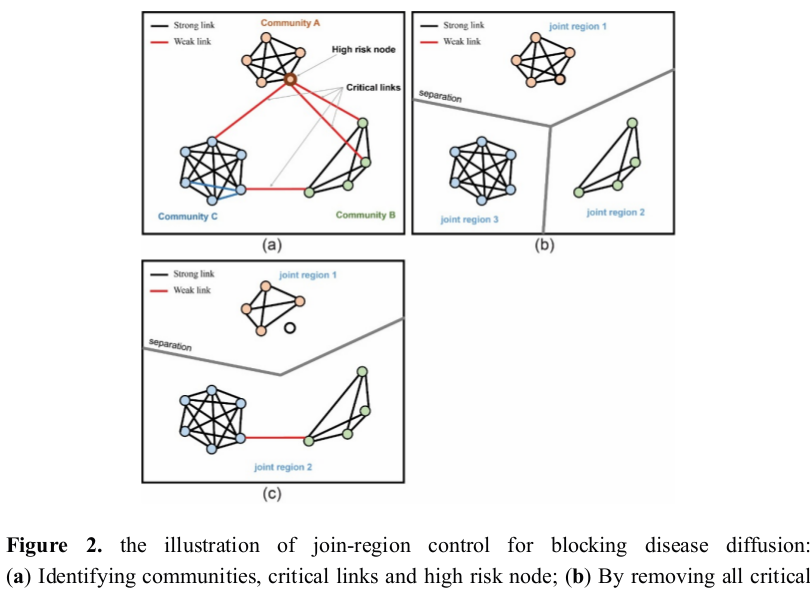
  
  ---
  
- Lee, J., Lay, J. G., **Chin, W. C. B.**, Chi, Y. L., & Hsueh, Y. H. (2014). An Experiment to Model Spatial Diffusion Process with Nearest Neighbor Analysis and Regression Estimation. *International Journal of Applied Geospatial Research* 5(1), 1-15. 
  <i class="ai ai-doi"></i>: [10.4018/ijagr.2014010101](https://doi.org/10.4018/ijagr.2014010101)
  

  
  
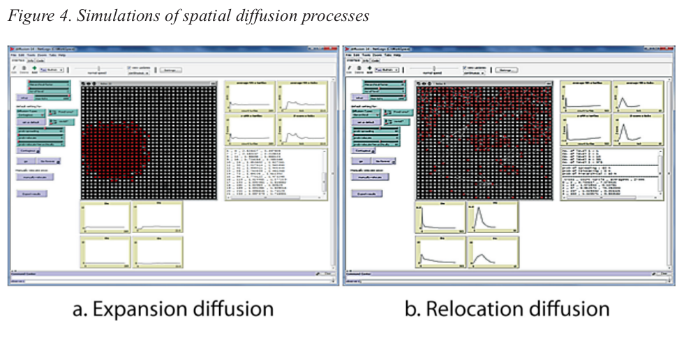
  
  ---

### Book Chapter
- Wen, T. H., **Chin, W. C. B.**, & Lai, P. C. (2016). Link structure analysis of urban street networks for delineating traffic impact areas. In M. Nemiche, M. Essaaidi (eds.), *Advances in Complex Societal, Environmental and Engineered Systems, Nonlinear Systems and Complexity 18*. Part 2: 203-220. Springer: Switzerland. 
  <i class="ai ai-doi"></i>: [10.1007/978-3-319-46164-9_10](https://doi.org/10.1007/978-3-319-46164-9_10), ISBN: 978-3-319-46164-9.
  

    
  
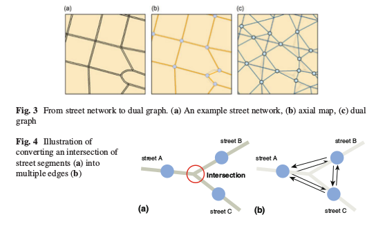
  
  ---

### TSSCI Journal Article  
- 郭年真，林民浩，陳威全，溫在弘 (2016)。剖析台灣民眾的就醫流動：利用引力模式評估就醫距離與醫療資源分布的影響。*台灣衛誌* 35(2)：136-151。
  <i class="ai ai-doi"></i>: [10.6288/TJPH201635104086](https://doi.org/10.6288/TJPH201635104086).  
  (eng. info) Lin, M. H., Kuo, R. N., Chin, W. C. B., & Wen, T. H. (2015). Profiling the patient flow for seeking healthcare in Taiwan: using gravity modeling to investigate the influences of travel distance and healthcare resources (in chinese). *Taiwan Journal of Public Health* 35(2): 136-151. 
  <i class="ai ai-doi"></i>:[10.6288/TJPH201635104086](https://doi.org/10.6288/TJPH201635104086).
  

  
  
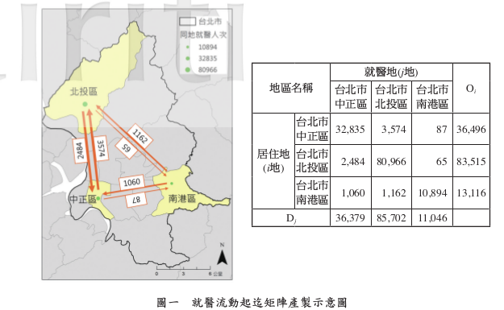
  
  ---
  
  
### arXiv / medRxiv
- Chin, W. C. B., & Huang C. Y. (2020). Using EpiRank for Analyzing Emerging Coronavirus Epidemic Patterns. 
  medRxiv <i class="ai ai-doi"></i>: [10.1101/2020.04.20.20072736](https://doi.org/10.1101/2020.04.20.20072736).
  

  

### Manuscript in preparation/Ongoing study    
- The effects of point clustering properties on spatial scaling patterns. (manuscript in preparation).  
- A two-levels agent based model of social segregation. (rethinking model).  
- Fractal skylines series (in preparation)  
- Vertical displacement activities series (in preparation)  
- A socio-ecological perspective on COVID-19 spatiotemporal integrated vulnerability in Singapore (submitted book chapter, under review)  
- Emotional response through COVID-19 in Singapore (submitted book chapter, under review)  

## Conferences Presentations
- 2018 - Delineating communities of cities in space and times, in **18th Chinese Cartography Academic Conference**, Taipei, Taiwan.
- 2017 - Lifestyle of a city: An urban life footprint analysis using Twitter data in Tokyo, in **TGSW 2017**, Tsukuba, Japan. **Young Scientist Award**  
  Link: [http://bit.ly/tgsw17_lifestyleofcity](http://bit.ly/tgsw17_lifestyleofcity)    
- 2017 - Exploring space-time diffusion process of Dengue Fever in Kaohsiung City, Taiwan, in **7th Asian Seminar in Regional Science**, Taipei, Taiwan.  
  Link: [http://bit.ly/asrs2017chin](http://bit.ly/asrs2017chin)  
- 2017 - Applying space-time information to explore disease processes: The dynamic patterns of Dengue Fever in Kaohsiung City, 1998-2015. Poster session in **Annual Meeting of the SRA‐Taiwan 2017**, Taichung, Taiwan. **Excellent Student Poster Award**  
  Link: [https://wcchin.github.io/pdfs/poster_tsra_2017.pdf](https://wcchin.github.io/pdfs/poster_tsra_2017.pdf)  
- 2016 - Profiling topological characteristics of street network to identify urban traffic congestion, in **15th Conference for Global Spatial Data Infrastructure Association (GSDI)**, Taipei, Taiwan.  
  Link: [http://bit.ly/gsdi2016chin](http://bit.ly/gsdi2016chin)  
- 2016 - 從路段的連接性與流率分析城市內街道的流量以探討城市交通擁塞問題，**發展研究年會**，臺北，臺灣。  
  Understanding urban traffic congestion by analyzing the link structure and the vehicle flows of urban street network, in **8th Conference on Development Studies**, Taipei, Taiwan.  
  Link: [http://bit.ly/acds2016chin](http://bit.ly/acds2016chin)  
- 2016 - Link structure analysis of urban road networks for identifying traffic impact areas, in **NetSci 2016**, Seoul, South Korea.  
  Link: [http://bit.ly/netsci2016benny](http://bit.ly/netsci2016benny)  
- 2015 - A Web-based Framework for Monitoring Spatial-temporal Clustering of Epidemics in Taiwan, in **FOSS4G 2015**, Seoul, South Korea.  
  Link: [http://bit.ly/foss4g2015chin](http://bit.ly/foss4g2015chin)  
- 2014 - 考量地理特性的 PageRank 演算法： 評估地理網絡節點之重要性， **中國地理學會年會**，臺北，臺灣。  
  Geographically modified PageRank algorithms: Measuring the importance of nodes in a geospatial network, in **Annual Meeting of The Geography Society of China located in Taipei**, Taipei, Taiwan.  
  Link: [http://bit.ly/gprGEOGSOC2014](http://bit.ly/gprGEOGSOC2014)  
- 2013 - Geographically modified PageRank Algorithm: Measuring the importance of nodes in a geospatial network, in **AAG Annual Meeting 2013**, Los Angeles, USA.  
  Link: [http://bit.ly/gprAAG2013](http://bit.ly/gprAAG2013)  
- 2012 - 整合PageRank與空間互動模型於網絡都市的拓樸動態分析，**中國地理學會年會**，臺北，臺灣。  
  Integration of PageRank and Spatial Interaction Modeling to Analyze Topological Dynamics of Networked Cities, in **Annual Meeting of The Geography Society of China located in Taipei**, Taipei, Taiwan.  
  Link: [http://bit.ly/cityPR2012](http://bit.ly/cityPR2012)  

