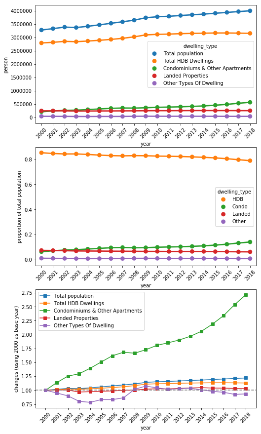
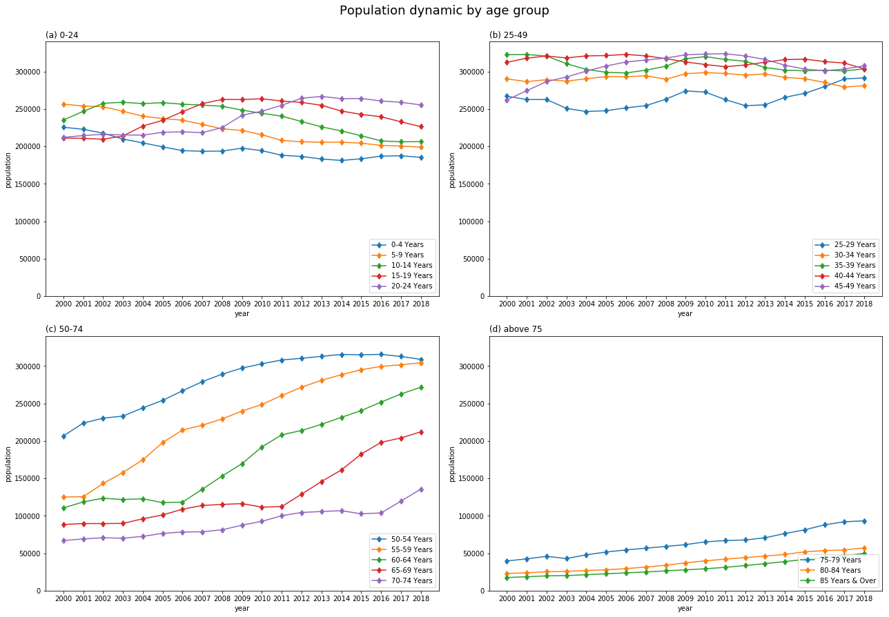
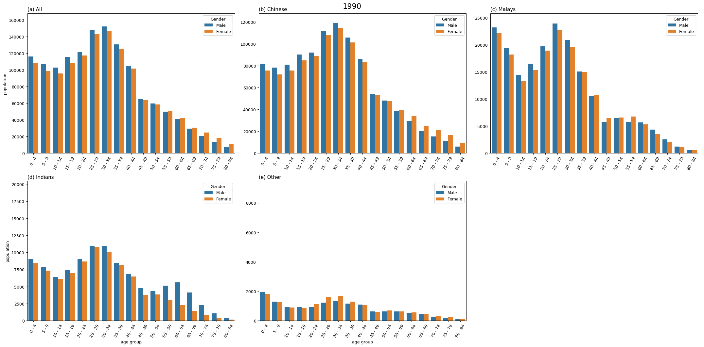
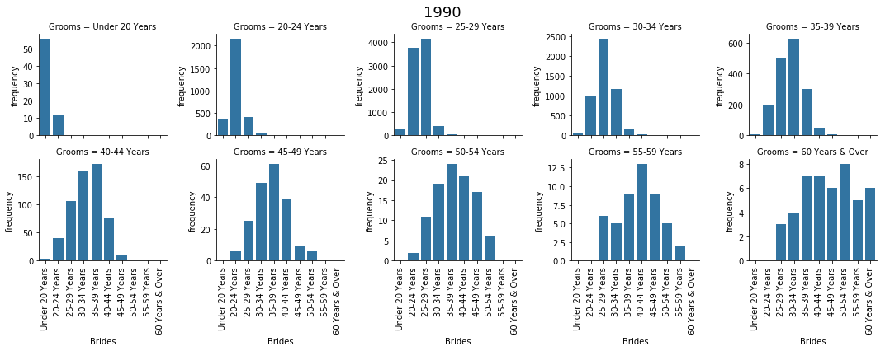

title: About Singapore Demography
---

# About Singapore Demography - part 1

This page is about the first step starting to understand and describe the demography of Singapore. 

## Dwelling types
  
Fig. 1. The dynamic of dwelling types from 2000 to 2018. The total number of people live in HDB, condo, landed, and other. 

While the total population increase slowly, the number of people live in HDB also increase slowly with a different speed (a). The # people live in condo increase faster than the HDB. This caused the proportion of HDB decreaase and condo increase (b). From (c), the share of condo in 2018 increased to about 2.75 times the # people live in condo in 2000. 

## The aging population dynamic

Fig. 2. Population dynamic by age group. Which age-group of people is contributing to the population increse?

The figure shows the population dynamic from 2000 to 2018. 
The total number of people in Singapore keep rising. The number of new born child and pre-school age childrens are decreasing (a); only the young adult (20-24) increase during 2008-2012. 
The number of adult people (25-49) seems maintained in a stable number until 2018. But because of the young people in (a) shows decreasing trend, it is expected that the adult people will also go to decreasing stage in the following decade. 
The number of elderly people (>=50, in c and d) keep rising. This is a typical population dynamic pattern that indicates an aging population. 

## The dynamic of age-specific sex differences by ethnics
  
Fig. 3. The age-specific sex differences from 1990 to 2017 by ethnics. 

The Chinese (b), Malays (c), and Indians (d) dynamic pattern happens are different. 
In all sub-figures, there are two high waves, one indicated the parents (older), and the other POSSIBLY indicates their children. 
The chinese older wave is higher than the younger wave, which also shows possible increses from immigrations from the outside world (i.e. not all grow from the younger wave). 
The malays waves on the other hand, show that the younger wave is higher than the older wave at the begining, which stablely grow old with a little decreasing (become lower in the recent year). 
The indians older wave is higher than the younger wave, similar to the chinese; but there are significant increase of older wave in 1998-2011; which mostly were male. 
The others sub-figure also shows significant increase of older wave in 1998-2011, in which female is more than male. 

There is a little bit unknown is that for the young people, bars of male are normaly higher than the bars of female, indicated that more boys than girls. 
But when they grow up (the wave move to the right), the bars of female are higher than the bars of male, i.e. more woman than man. This could be due to the gender differences of immigrants and emigrants, i.e. more woman come to SG than man, and more man leave SG than woman. But of cause this require further investigation to understand this observation. 

## The grooms and brides that the woman and man chose to get married with
  
Fig. 4. Which age group of man would the brides in specific age group marry to? 

Women tend to marry to someone in the age group of 1-level higher or the same level, i.e. about 0-9 years older than themself. 

  
Fig. 5. Which age group of woman would the grooms in specific age group choose to marry? 

On the other hand, the choices of men change with ages. Very young people (<24) would choose ladies in the same group, or maybe 1 level older. Men in age 25-44 would choose ladies in 1 level younger or in the same age-group. Men in age 44 and above would choose ladies in  2 levels younger or even 3-4 levels younger. 

